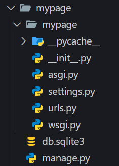
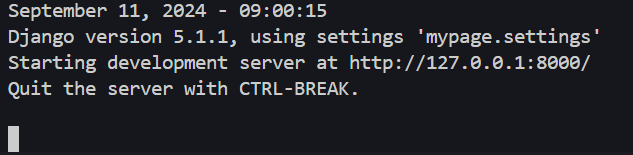
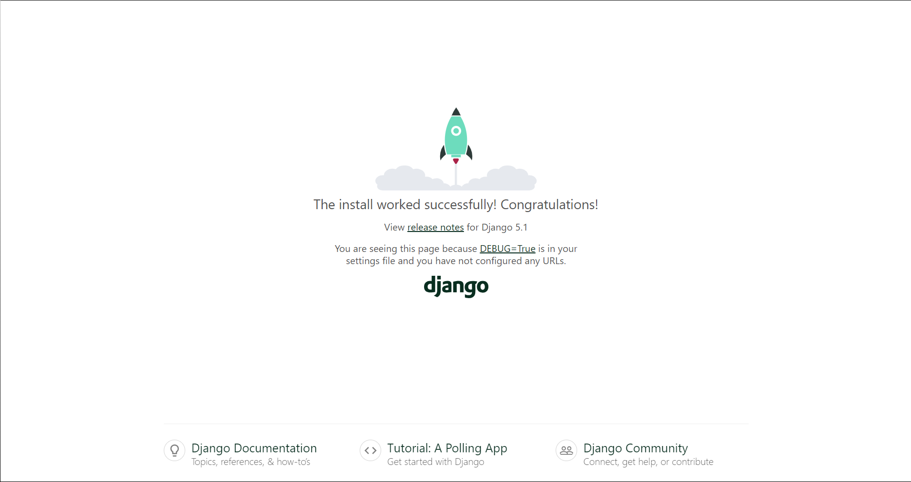

# Estrutura do Projeto Django.

## Criando Projeto Django.

Após a instalação, para iniciar um projeto em Django execute o comando com essa configuração:

django-admin startproject 'nome do projeto'

```
    django-admin startproject mypage
```
Após a execução do comando uma pasta com a seguinte configuração será criada:


Na pasta teremos o arquivo `manage.py`, o arquivo responsável por gerenciar o projeto Django,
e a pasta **mypage**, que é onde há os outros arquivos do projeto estão armazenados.

## Visualização do Servidor.

Após a criação do projeto, para colocar nosso site no ar devemos escrever os seguintes comandos:

### Para acessar o Projeto:
```
    cd mypage
```

### Para rodar o Server:
```
    python manage.py runserver
```
Esse comando é o que coloca o site no ar. O Framework Django já traz muitas funcionalidades
prontas, como sistema administrativo, sistema de autentificação, sistema de controle de sessões
e cookies, assim por diante.

Depois de executarmos a primeira vez o nosso projeto em Django, também surgirá o banco de dados 
**db.sqlite3** dentro da pasta dele.



No terminal que você executou o código será mostrado o endereço do servidor local para que você 
acesse o projeto:



Adicionando o link em um navegador veremos a seguinte página:



## Estrutura do Projeto Django 


O projeto terá o arquivo `manage.py` e a pasta com o mesmo nome do projeto.

Nessa pasta, temos o arquivo `__init__.py`, que está vazio. Este arquivo indica
para o Python que essa pasta `mypage` faz parte de um módulo Python.

Os arquivos `asgi.py` e `wsgi.py` são os arquivos de configuração que, quando colocarmos 
o site em um servidor, o servidor saberá como lidar com esse projeto. Utilizaremos esses
arquivos apenas no momento de fazer o **deploy** do projeto.

Além desses arquivos, também temos o `settings.py` e o `urls.py`. No arquivo `urls.py`, é onde definiremos os links, os endereços das páginas do nosso site. Já o `settings.py` é onde iremos de fato configurar o projeto. É dentro desse arquivo que definiremos as configurações e as informações essenciais para o nosso site funcionar corretamente.
