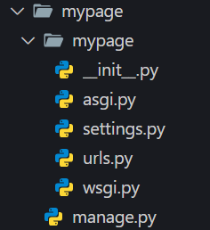

# Estrutura do Projeto Django.

## Criando Projeto Django.

Após a instalação, para iniciar um projeto em Django execute o comando com essa configuração:

django-admin startproject 'nome do projeto'

```
    django-admin startproject mypage
```
Após a execução do comando uma pasta com a seguinte configuração será criada:



Na pasta teremos o arquivo **manage.py**, o arquivo responsável por gerenciar o projeto Django,
e a pasta **mypage**, que é onde há os outros arquivos do projeto estão armazenados.

## Visualização do Servidor.

Após a criação do projeto, para colocar nosso site no ar devemos escrever os seguintes comandos:

### Para acessar o projeto:
```
    cd mypage
```

### Para rodar o server:
```
    python manage.py runserver
```
